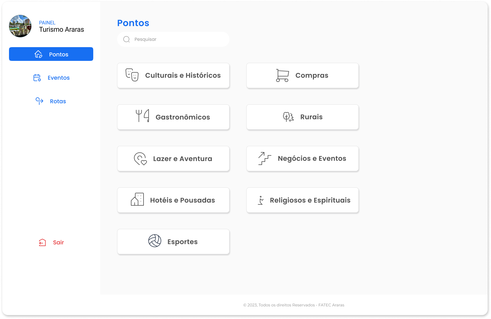

# Painel Administrativo do Projeto Turismo Araras
Este é o repositório do painel administrativo para o projeto Turismo Araras. Ele permite adicionar, editar e apagar pontos turísticos e rotas turísticas para a cidade de Araras.

# Recursos
- Pontos turísticos: Permite adicionar, editar e remover informações sobre pontos turísticos, incluindo nome, descrição, localização geográfica e imagens.
- Rotas turísticas: Permite criar, editar e remover rotas turísticas, selecionando pontos turísticos existentes e definindo a ordem de visita.

## Página principal
 

## Instalação
#### Clone este repositório para o seu ambiente local usando o comando abaixo:

```bash
git clone https://github.com/paulademelo/admin-website-turism.git
```

### Navegue até o diretório clonado:
```bash
cd painel-administrativo-turismo-araras
```
### Instale as dependências do projeto:
```bash
npm install
```

### Execute o painel administrativo localmente:

```bash
npm start
```
### Uso
Após a instalação e execução do painel administrativo, você pode acessá-lo em seu navegador usando o seguinte URL: http://localhost:3000.

# Contribuição
Contribuições são bem-vindas! Se você quiser melhorar este painel administrativo ou adicionar novos recursos, siga as etapas abaixo:

1. Faça um fork deste repositório.
2. Crie um novo branch com sua feature ou correção de bug:

```bash
git checkout -b nome-da-sua-feature
```

3. Faça as alterações desejadas e adicione os arquivos modificados:

```bash
git add .
```

4. Faça um commit das suas alterações:

```bash 
git commit -m "Descrição das alterações"
```
5. Envie seu branch para o repositório remoto:
```bash
git push origin nome-da-sua-feature
```
6. Abra um pull request neste repositório e aguarde a revisão e merge da sua contribuição.
 
# Licença
Este projeto está licenciado sob a licença da FATEC ARARAS.